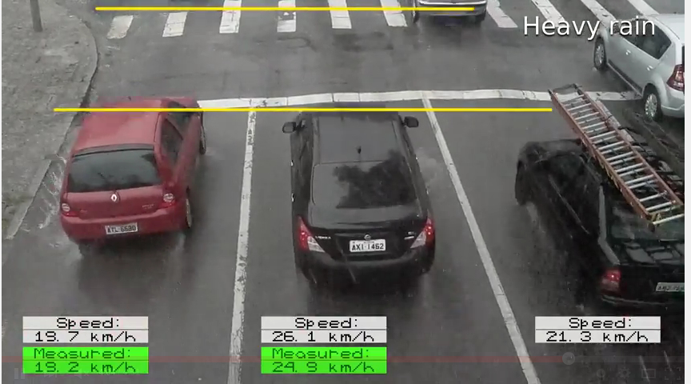

# Vehicle Detection and Speed Measurement System

This software is provided *as it is* in addition to the paper
> A Video-Based System for Vehicle Speed Measurement in Urban Roadways
.




## Dependencies

*vehicledsm* is a GStreamer plugin written in C/C++.
For compiling the project, the following tools are *required*:
* libtool
* autoconf
* libgstreamer1.0-dev
* libtesseract-dev
* libleptonica-dev
* gcc 5.5 (**or lower**)


## Dataset

To download the dataset, do:
```
  cd dataset
  bash download.sh
```

<!--### About the subdir training-->
<!--Enter in 'training/icdar' and run the script 'run.sh'.-->


## Build and run

Once all dependencies are correctly installed, configure the package and build
it with:
```
  cd gst-plugin
  ./autogen.sh
  make
```

If everything goes fine, the binary file `libgstplugin.so` must appear in
`gst-plugin/gstreamer/.libs`.

To inspect that file (check if it is working properly), do:
```
  cd gst-plugin/tools/
  ./inspect.sh
```
It should list the properties of the `vehicledsm` plugin.

To run the software with the provided videos (please download the dataset
first if not already done), do:
```
  cd gst-plugin/tools
  ./run-dsm.sh ../../dataset/set1/
```


## Citing

Please cite out paper if this software or any part of it is useful for you:
```
@ARTICLE{Luvizon_ITS_2016,
  author={D. C. Luvizon and B. T. Nassu and R. Minetto},
  journal={IEEE Transactions on Intelligent Transportation Systems},
  title={A Video-Based System for Vehicle Speed Measurement in Urban Roadways},
  year={2017},
  volume={18},
  number={6},
  pages={1393-1404},
  doi={10.1109/TITS.2016.2606369},
  ISSN={1524-9050},
  month={June},
}
```


### Some tips about GStreamer

Modify gst-plugin/src/Makefile.am to add or remove source files to build or
add additional dependencies or compiler flags or change the name of the
plugin file to be installed. Run ./autoregen.sh if changes don't take effect
automatically on 'make'.

Modify gst-plugin/configure.ac to check for additional library dependencies
or other features needed by your plugin. Run ./autoregen.sh if changes don't
take effect automatically on 'make'.

Once the plugin is built you can either install it with 'sudo make install'
(however, this will by default go into the /usr/local prefix where it won't
be picked up by a GStreamer installed from packages, so you would need to
set the GST_PLUGIN_PATH environment variable to include or point to
/usr/local/lib/gstreamer-1.0/ for your plugin to be found by a from-package
GStreamer). Alternatively, you will find your plugin binary in
gst-plugins/src/.libs/ as libgstplugin.so or similar (the extension may vary),
so you can also set the GST_PLUGIN_PATH environmen variable to the
gst-plugins/src/.libs/ directory (best to specify an absolute path though).


## Known issues

* For some unknown reason, the software crashes just after launched with a
`SIGSEGV`.


## License

This code is provided under a [MIT license](LICENSE), which basically means "do
with it as you wish, but don't blame us if it doesn't work". You can use this
code for any project as you wish, under any license as you wish.  We recommend
the use of the [LGPL license](COPYING.LIB) for applications and plugins, given
the minefield of patents the multimedia is nowadays.  See the [Gstreamer
website](http://gstreamer.freedesktop.org/documentation/licensing.html) for
details.

